# Sphira - DeFi Investment Platform on OneChain

*Production-ready DeFi platform for automated systematic investments on OneChain blockchain*

<div align="center">

[](https://opensource.org/licenses/MIT)
[](https://nextjs.org)
[](https://typescriptlang.org)
[](https://move-language.github.io)
[](https://onechain.network)

*Revolutionizing systematic investments with AI-powered yield optimization and emergency fund protection on OneChain's lightning-fast blockchain*

</div>

---

## 📋 Table of Contents

- [Overview](#-overview)
- [Features](#-features)
- [Architecture](#-architecture)
- [Quick Start](#-quick-start)
- [Deployment](#-deployment)
- [Smart Contracts](#-smart-contracts)
- [API Documentation](#-api-documentation)
- [Contributing](#-contributing)

---

## 🎯 Overview

Sphira is a comprehensive DeFi investment platform built on OneChain blockchain that enables:

- **Automated SIPs**: Systematic Investment Plans with customizable schedules
- **AI Yield Optimization**: Smart fund allocation across DeFi pools
- **Emergency Vault**: Multi-sig protected fund locking system
- **Real-time Analytics**: Portfolio tracking and performance metrics
- **Conversational UX**: Chat-based investment management

### Why OneChain?

- ⚡ **Lightning Fast**: Sub-5 second transaction finality
- 💰 **Ultra-Low Fees**: ~$0.00001 average transaction cost
- 🔒 **Secure**: Move smart contract language with resource-oriented programming
- 🌍 **Scalable**: 1,000+ TPS capacity

---

## 🚀 Features

### Core Functionality

#### 💎 Automated SIP System
- Daily, weekly, monthly investment schedules
- Multi-token support (OCT, USDC, etc.)
- Flexible parameters and early exit options
- Pause/resume capabilities

#### 🧠 AI-Powered Yield Optimization
- Dynamic fund allocation across 20+ DeFi pools
- Risk-adjusted returns with auto-rebalancing
- Predictive analytics for optimal yields
- Real-time performance tracking

#### 🛡️ Emergency Vault Protection
- Multi-sig security (3-of-5 governance)
- Time-lock mechanisms with configurable penalties
- Community governance for emergency unlocks
- Complete audit trail transparency

#### 📊 Real-time Dashboard
- Portfolio overview with live balance
- Active SIPs tracking
- Yield performance charts
- Recent activity feed

---

## 🏗️ Architecture

### System Architecture Diagram


### User Flow Diagram

```mermaid
sequenceDiagram
    participant U as User
    participant W as Wallet
    participant F as Frontend
    participant B as Blockchain
    participant C as Smart Contract
    
    U->>W: Connect Wallet
    W->>F: Wallet Connected
    F->>B: Request Balance
    B->>F: Return Balance
    
    U->>F: Create SIP
    F->>W: Request Signature
    W->>U: Confirm Transaction
    U->>W: Approve
    W->>C: Execute create_sip()
    C->>B: Store SIP Object
    B->>F: Transaction Success
    F->>U: SIP Created ✅
```



### SIP Execution Flow


### Smart Contract Architecture


---

## 🚀 Quick Start

### Prerequisites

- Node.js 18+ and npm
- OneChain CLI (`one`)
- Git

### Installation

1. **Clone the repository**
```bash
git clone https://github.com/yourusername/sphira-defi.git
cd sphira-defi
```

2. **Install dependencies**
```bash
npm install
```

3. **Set up environment variables**
```bash
cp .env.example .env
```

Edit `.env` with your configuration:
```env
NEXT_PUBLIC_ONECHAIN_NETWORK=testnet
NEXT_PUBLIC_ONECHAIN_RPC_URL=https://rpc-testnet.onelabs.cc:443
NEXT_PUBLIC_ONECHAIN_FAUCET_URL=https://faucet-testnet.onelabs.cc/v1/gas

# Smart Contract Package IDs (update after deployment)
NEXT_PUBLIC_SIP_MANAGER_PACKAGE_ID=YOUR_PACKAGE_ID
NEXT_PUBLIC_YIELD_ROUTER_PACKAGE_ID=YOUR_PACKAGE_ID
NEXT_PUBLIC_LOCK_VAULT_PACKAGE_ID=YOUR_PACKAGE_ID

# Shared Object IDs
NEXT_PUBLIC_SIP_MANAGER_OBJECT_ID=YOUR_SIP_MANAGER_ID
NEXT_PUBLIC_YIELD_ROUTER_OBJECT_ID=YOUR_YIELD_ROUTER_ID
NEXT_PUBLIC_VAULT_MANAGER_OBJECT_ID=YOUR_VAULT_MANAGER_ID

# AI Configuration
GOOGLE_GEMINI_API_KEY=your_api_key_here
```

4. **Run development server**
```bash
npm run dev
```

Open [http://localhost:3000](http://localhost:3000) in your browser.

---

## 📦 Deployment

### Deploy to Netlify

#### Option 1: One-Click Deploy

[](https://app.netlify.com/start/deploy?repository=https://github.com/yourusername/sphira-defi)

#### Option 2: Manual Deployment

1. **Build the project**
```bash
npm run build
```

2. **Install Netlify CLI**
```bash
npm install -g netlify-cli
```

3. **Login to Netlify**
```bash
netlify login
```

4. **Deploy**
```bash
netlify deploy --prod
```

#### Option 3: GitHub Integration

1. Push your code to GitHub
2. Go to [Netlify](https://app.netlify.com)
3. Click "New site from Git"
4. Select your repository
5. Configure build settings:
   - **Build command**: `npm run build`
   - **Publish directory**: `.next`
   - **Node version**: 18

6. Add environment variables in Netlify dashboard:
   - Go to Site settings → Environment variables
   - Add all variables from `.env`

7. Deploy!

### Deployment Workflow

```mermaid
graph LR
    A[Push to GitHub] --> B[Netlify Detects Change]
    B --> C[Install Dependencies]
    C --> D[Run Build]
    D --> E[Deploy to CDN]
    E --> F[Live Site ✅]
    
    style F fill:#00D382
```



### Environment Variables Setup


---

## 🔧 Smart Contracts

### Deploy Smart Contracts

1. **Install OneChain CLI**
```bash
cargo install --locked --git https://github.com/one-chain-labs/onechain.git one_chain
mv ~/.cargo/bin/one_chain ~/.cargo/bin/one
```

2. **Create Wallet**
```bash
one client
# Save your recovery phrase!
```

3. **Get Test OCT**
```bash
one client faucet
```

4. **Build Contracts**
```bash
cd contracts
one move build
```

5. **Test Contracts**
```bash
one move test
```

6. **Deploy Contracts**
```bash
one client publish --gas-budget 100000000
```

7. **Update .env with deployed addresses**

### Contract Addresses

After deployment, you'll receive:
- **Package ID**: The deployed package address
- **Shared Object IDs**: SIP Manager, Yield Router, Vault Manager

Update your `.env` file with these addresses.

---

## 📚 API Documentation

### REST Endpoints

#### SIPs
- `GET /api/sips?userAddress={address}` - List user's SIPs
- `POST /api/sips` - Create new SIP
- `GET /api/sips/[id]` - Get SIP details
- `DELETE /api/sips/[id]` - Cancel SIP

#### Portfolio
- `GET /api/portfolio?userAddress={address}` - Get portfolio overview

#### Activity
- `GET /api/activity?userAddress={address}` - Get recent activity

#### Notifications
- `GET /api/notifications?userAddress={address}` - Get notifications
- `POST /api/notifications` - Mark as read

#### Analytics
- `GET /api/analytics` - Get platform analytics

#### Yield Pools
- `GET /api/yield/pools` - List available yield pools

---

## 🧪 Testing

### Run Tests
```bash
npm run test
```

### Smart Contract Tests
```bash
cd contracts
one move test
```

### E2E Tests
```bash
npm run test:e2e
```

---

## 🤝 Contributing

We welcome contributions! Please follow these steps:

1. Fork the repository
2. Create a feature branch: `git checkout -b feature/amazing-feature`
3. Commit your changes: `git commit -m 'Add amazing feature'`
4. Push to the branch: `git push origin feature/amazing-feature`
5. Open a Pull Request

### Development Workflow


---

## 📄 License

This project is licensed under the MIT License - see the [LICENSE](LICENSE) file for details.

---

## 🆘 Support

- **Documentation**: [docs.sphira.finance](https://docs.sphira.finance)
- **Discord**: [discord.gg/sphira](https://discord.gg/sphira)
- **Email**: support@sphira.finance
- **Issues**: [GitHub Issues](https://github.com/yourusername/sphira-defi/issues)

---

## 🙏 Acknowledgments

- OneChain team for the amazing blockchain platform
- Sui/Move community for the smart contract framework
- Next.js team for the incredible web framework
- All contributors and supporters

---

**Built with ❤️ for the future of decentralized finance**

*Powered by OneChain • Secured by Move • Built with Next.js*
